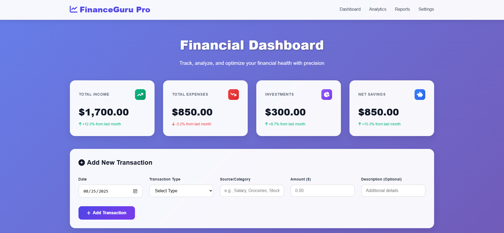
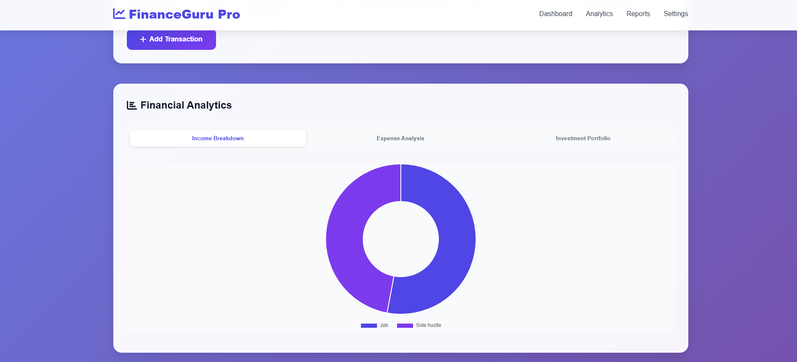
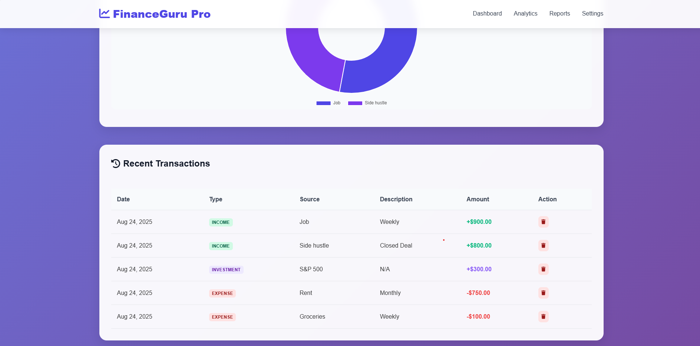

**FinanceGuru Pro - Personal Financial Dashboard**
Developed a web-based financial tracking application built with Flask and interactive charts.

**Features**

Real-time Dashboard: Track income, expenses, investments, and net savings
Transaction Management: Add, view, and categorize financial transactions
Data Visualization: Interactive charts showing financial breakdowns and trends
Excel Integration: Import/export data via Excel files
Analytics: Detailed insights into spending patterns and top categories

**Tech Stack**
Backend:

Flask 2.3.3 (Python web framework)
SQLite (Database)
Pandas (Data processing)
Matplotlib/Seaborn (Chart generation)

Frontend:

HTML5/CSS3 with responsive design
Vanilla JavaScript
Chart.js for interactive visualizations
Font Awesome icons

**Key Functionality**

Add transactions via web form or Excel upload
Real-time financial calculations and summaries
Professional chart generation with trend analysis
Responsive design for all devices
Secure file handling and data validation

**Installation**
bashpip install -r requirements.txt
python main.py

**Home Page**

**Analysis**

**Recent Transactions**

**Incomplete Portions**

Dashboard header buttons still need to be properly linked
Excel template needs to be provided if users prefer to use that
Further analysis provided by the script should be provided after analyzing the user's expenses
